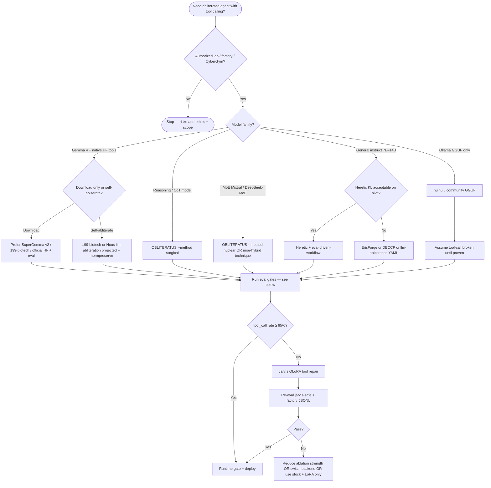
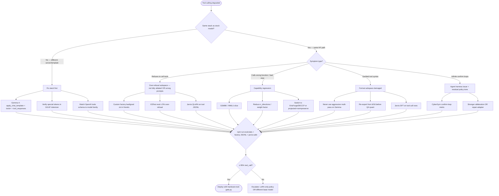

# Abliteration & low-VRAM tooling catalog

Tools for **weight surgery**, **4-bit measure**, **LoRA export**, **quantized inference**, and **agent deployment**. GitHub-first — see [../../references.md](../../references.md).

---

## Core abliteration (safetensors surgery)

| Tool | URL | Role | VRAM notes |
|------|-----|------|------------|
| **Heretic** | [p-e-w/heretic](https://github.com/p-e-w/heretic) | **Primary** — automatic Optuna + projected + norm-preserving | `bnb_4bit`, CPU offload; PyPI `heretic-llm` |
| **Heretic pins (this repo)** | [heretic-tools-reference.md](heretic-tools-reference.md) | Immutable configs, HF registry | Offline copy-paste |
| **llm-abliteration** | [jim-plus/llm-abliteration](https://github.com/jim-plus/llm-abliteration) | **v1.2** (Jan 2026) measure → analyze → sharded ablate | 4-bit measure; **full-weight ablate** |
| **refusal_direction** | [andyrdt/refusal_direction](https://github.com/andyrdt/refusal_direction) | Paper reproduction | Research GPU |
| **remove-refusals-with-transformers** | [Sumandora/remove-refusals-with-transformers](https://github.com/Sumandora/remove-refusals-with-transformers) | Pure HF, no TransformerLens | Medium |
| **abliterate.cpp** | [kabachuha/abliterate.cpp](https://github.com/kabachuha/abliterate.cpp) | GGUF-native direction measure → llm-abliteration | WIP experimental |
| **Abliterix** | [wuwangzhang1216/abliterix](https://github.com/wuwangzhang1216/abliterix) | Optuna TPE multi-objective; 150+ configs; MoE/VL/SSM; LoRA/ORBA/SAE | Heretic-lineage; HonestAbliterationBench; AGPL-3.0 |
| **ErisForge** | [Tsadoq/ErisForge](https://github.com/Tsadoq/ErisForge) | Layer-band single-pass; `ExpressionRefusalScorer` | GSM8K-friendly subset; lower arch coverage |
| **TransformerLens** | [TransformerLensOrg/TransformerLens](https://github.com/TransformerLensOrg/TransformerLens) | Hooks, direction probes | 1–3B on 8 GB |
| **wassname/abliterator** | [wassname/abliterator](https://github.com/wassname/abliterator) | Community | Legacy |
| **FailSpy/abliterator** | [FailSpy/abliterator](https://github.com/FailSpy/abliterator) | TransformerLens hooks; temp/permanent ablation | Notebook prototyping; narrow arch support |
| **Nous llm-abliteration** | [NousResearch/llm-abliteration](https://github.com/NousResearch/llm-abliteration) | jim-plus fork; YAML + sharded ablate + `--deccp` | 4-bit measure; lowest peak VRAM for large models |
| **OBLITERATUS** | [elder-plinius/OBLITERATUS](https://github.com/elder-plinius/OBLITERATUS) | SVD + entanglement analysis; `surgical` CoT-aware mode | Hermes Agent skill |
| **huihui_ai** | [ollama.com/huihui_ai](https://ollama.com/huihui_ai/gemma-4-abliterated) | Sumandora abliterates; layer-banded GGUF drops | Fast uncensor, weak tool QA |
| **199-biotech Gemma 4** | [gemma-4-abliterated](https://github.com/199-biotechnologies/gemma-4-abliterated) | Per-layer MLX pipeline; weight factor 1.0 | Gemma 4 31B quality-first |

**Master toolchain doc:** [../toolchain-safetensors-gguf-lora.md](../toolchain-safetensors-gguf-lora.md) · Safetensors: [../../methods/safetensor-abliteration-pipeline.md](../../methods/safetensor-abliteration-pipeline.md)

Workflows: [../../instructions/heretic-workflow.md](../../instructions/heretic-workflow.md) · [../../instructions/low-vram-abliteration.md](../../instructions/low-vram-abliteration.md)

**Extended toolkit (Abliterix, ErisForge, Nous/DECCP, FailSpy):** comparison table, commands, decision tree → [../../techniques/extended-abliteration-toolkit.md](../../techniques/extended-abliteration-toolkit.md)

---

## Quantization & memory

| Tool | URL | Role |
|------|-----|------|
| **bitsandbytes** | [bitsandbytes-foundation/bitsandbytes](https://github.com/bitsandbytes-foundation/bitsandbytes) | 4/8-bit load for measure & infer |
| **Accelerate** | [huggingface/accelerate](https://github.com/huggingface/accelerate) | `device_map`, `max_memory` offload |
| **auto-gptq** | [AutoGPTQ/AutoGPTQ](https://github.com/AutoGPTQ/AutoGPTQ) | GPTQ quant (post-abliteration) |
| **autoawq** | [casper-hansen/AutoAWQ](https://github.com/casper-hansen/AutoAWQ) | AWQ quant |
| **llama.cpp** | [ggml-org/llama.cpp](https://github.com/ggml-org/llama.cpp) | GGUF convert + `llama-quantize` |
| **Ollama** | [ollama/ollama](https://github.com/ollama/ollama) | Local GGUF serving |
| **LM Studio** | [lmstudio.ai](https://lmstudio.ai/) | GUI GGUF (desktop) |

Typical post-abliteration chains:

```bash
# Merged full weights → Ollama
convert_hf_to_gguf.py → llama-quantize Q4_K_M → ollama create

# LoRA sidecar → llama.cpp (keep base GGUF)
export-abliteration-lora.py → convert_lora_to_gguf.py → llama-cli --lora

# Browser LoRA convert
# huggingface.co/spaces/ggml-org/gguf-my-lora
```

→ [../../methods/gguf-export-notes.md](../../methods/gguf-export-notes.md)

---

## LoRA / QLoRA stack

| Tool | URL | Role |
|------|-----|------|
| **PEFT** | [huggingface/peft](https://github.com/huggingface/peft) | LoRA adapters; merge for GGUF |
| **export-abliteration-lora.py** | [../../scripts/export-abliteration-lora.py](../../scripts/export-abliteration-lora.py) | ΔW → adapter safetensors |
| **convert_lora_to_gguf.py** | [ggml-org/llama.cpp](https://github.com/ggml-org/llama.cpp) | PEFT LoRA → GGUF sidecar |
| **GGUF-my-LoRA** | [spaces/ggml-org/gguf-my-lora](https://huggingface.co/spaces/ggml-org/gguf-my-lora) | Web convert PEFT → GGUF |
| **grimjim abliteration LoRA** | [Llama-3-Instruct-abliteration-LoRA-8B](https://huggingface.co/grimjim/Llama-3-Instruct-abliteration-LoRA-8B) | Refusal removal as trained adapter |
| **Unsloth** | [unslothai/unsloth](https://github.com/unslothai/unsloth) | Fast 4-bit QLoRA + `save_pretrained_gguf` |
| **TRL** | [huggingface/trl](https://github.com/huggingface/trl) | DPO/SFT trainers (Jarvis repair) |
| **Axolotl** | [axolotl-ai-cloud/axolotl](https://github.com/axolotl-ai-cloud/axolotl) | YAML-driven QLoRA fine-tunes |
| **torchtune** | [pytorch/torchtune](https://github.com/pytorch/torchtune) | Meta fine-tuning recipes |

| Use case | Tool |
|----------|------|
| Heretic norm-preserving LoRA | Built into Heretic `row_normalization = full` |
| ΔW → adapter export | [../../methods/lora-adapter-export.md](../../methods/lora-adapter-export.md) |
| Post-abliteration tool repair | Jarvis pack + Unsloth/TRL QLoRA |

Theory: [../../techniques/lora-qlora-abliteration.md](../../techniques/lora-qlora-abliteration.md)

---

## Inference servers (agents)

| Tool | URL | Role |
|------|-----|------|
| **vLLM** | [vllm-project/vllm](https://github.com/vllm-project/vllm) | High-throughput API; LoRA slots |
| **llama.cpp server** | [ggml-org/llama.cpp](https://github.com/ggml-org/llama.cpp) | CPU/GPU GGUF |
| **text-generation-webui** | [oobabooga/text-generation-webui](https://github.com/oobabooga/text-generation-webui) | UI + extensions |
| **ExLlamaV2** | [turboderp/exllamav2](https://github.com/turboderp/exllamav2) | Fast 4-bit CUDA infer |
| **koboldcpp** | [LostRuins/koboldcpp](https://github.com/LostRuins/koboldcpp) | Portable GGUF |

CyberGym / OpenHands: point agent at OpenAI-compatible endpoint (`vLLM` or `llama.cpp --api`).

---

## Apple Silicon & CPU-only

| Tool | URL | Role |
|------|-----|------|
| **mlx-lm** | [ml-explore/mlx-examples](https://github.com/ml-explore/mlx-examples/tree/main/llms) | MLX quant + LoRA on Mac |
| **llama.cpp** (Metal) | [ggml-org/llama.cpp](https://github.com/ggml-org/llama.cpp) | Best Mac GGUF path |

Surgery on Mac: prefer cloud Heretic + local GGUF.

---

## Optimization & search

| Tool | URL | Role |
|------|-----|------|
| **Optuna** | [optuna/optuna](https://github.com/optuna/optuna) | Heretic TPE search backend |
| **PaCMAP** | [YingfanWang/PaCMAP](https://github.com/YingfanWang/PaCMAP) | Heretic residual plots (`[research]` extra) |

---

## Interpretability & advanced direction finding

| Tool | URL | Role |
|------|-----|------|
| **GemmaScope** | [google/gemma-scope](https://huggingface.co/google/gemma-scope-9b-it-res) | JumpReLU SAEs for refusal latents |
| **andyrdt SAEs** | [saes-llama-3.1-8b-instruct](https://huggingface.co/andyrdt/saes-llama-3.1-8b-instruct) | Llama 3.1 residual SAEs |
| **TransformerLens** | [TransformerLensOrg/TransformerLens](https://github.com/TransformerLensOrg/TransformerLens) | Hooks, activation cache |
| **repeng / RepE** | [arxiv 2310.01405](https://arxiv.org/abs/2310.01405) | Representation engineering vectors |
| **TUM geometry-of-refusal** | [cs.cit.tum.de/daml/geometry-of-refusal](https://www.cs.cit.tum.de/daml/geometry-of-refusal/) | Gradient RDO code |
| **GraySwan circuit-breakers** | [GraySwanAI/circuit-breakers](https://github.com/GraySwanAI/circuit-breakers) | Defensive training (contrast) |
| **ErisForge** | [Tsadoq/ErisForge](https://github.com/Tsadoq/ErisForge) | Layer-band ablation + refusal scorer |
| **Abliterix** | [wuwangzhang1216/abliterix](https://github.com/wuwangzhang1216/abliterix) | Multi-technique automation; HonestAbliterationBench |
| **FailSpy/abliterator** | [FailSpy/abliterator](https://github.com/FailSpy/abliterator) | Activation cache + hook ablation |
| **Nous llm-abliteration** | [NousResearch/llm-abliteration](https://github.com/NousResearch/llm-abliteration) | Sharded manual pipeline + DECCP measure |

---

## Datasets (refusal taxonomy)

| Dataset | Use |
|---------|-----|
| mlabonne/harmful_behaviors | Heretic default bad |
| mlabonne/harmless_alpaca | Heretic default good |
| SorryBench splits | Category-specific directions |
| CoCoNot | Contextual non-compliance |
| XSTest | Over-refusal measurement |
| WildGuardMix | Safety core prompts |
| Custom factory `.txt` | WMI/nmap false-refusal pairs |

---

## Datasets (direction estimation)

| Dataset | URL | Use |
|---------|-----|-----|
| mlabonne/harmless_alpaca | HF | Heretic default good prompts |
| mlabonne/harmful_behaviors | HF | Heretic default bad prompts |
| deccp | [AUGMXNT/deccp](https://github.com/AUGMXNT/deccp) | llm-abliteration `--deccp` |

Custom: one prompt per line `.txt` or JSONL — see Heretic `config.default.toml` `[good_prompts]` / `[bad_prompts]`.

---

## Agent & eval (this repo)

| Asset | Path |
|-------|------|
| Jarvis tool repair v7 | [../../sources/jarvis-pack/IMPORT.md](../../sources/jarvis-pack/IMPORT.md) |
| hardware-tool-gate | [../../scripts/hardware-tool-gate.py](../../scripts/hardware-tool-gate.py) |
| Cyber eval prompts | [../../data/eval/cyber-research-prompts.jsonl](../../data/eval/cyber-research-prompts.jsonl) |
| Factory eval | [../../data/eval/hardware-factory-prompts.jsonl](../../data/eval/hardware-factory-prompts.jsonl) |
| OpenHands | [github.com/OpenHands/OpenHands](https://github.com/OpenHands/OpenHands) |
| CyberGym | [cybergym.io](https://cybergym.io) |

---

## Agent & tool-calling: tool picker (Nous, huihui, OBLITERATUS, SuperGemma)

Use this section when the deploy goal is **agents with online/native tool calling** — not just uncensored chat. Refusal removal and **structured tool output** (`<|tool_call>`, OpenAI `tool_calls`, JSON tool schemas) are different success criteria.

> **Gemma 4 native tools** require `processor.apply_chat_template(..., tools=[...])` and multi-turn `tool_responses` — see [Google function-calling guide](https://ai.google.dev/gemma/docs/capabilities/text/function-calling-gemma4).

### Prominent stacks compared

| Stack | Engine | Typical target | Tool-call preservation | Best for |
|-------|--------|----------------|------------------------|----------|
| **Heretic** (handbook default) | Optuna + projected + norm-preserving | Any HF instruct model | Medium — tune KL + eval gates | Automatic deploy + factory/CyberGym eval |
| **Abliterix** | Optuna TPE multi-objective; 150+ presets; MoE/VL/SSM | Gemma 4, MoE, hybrid, VL families | Medium-high when preset matches — verify HonestAbliterationBench + handbook JSONL | Heretic alternative when arch-specific automation needed |
| **Nous / jim-plus llm-abliteration** | `measure.py` → YAML `sharded_ablate.py` | Llama, Qwen, Gemma 3+, Mistral | Medium-low if conservative YAML | Manual per-architecture control; 20B+ sharded |
| **Nous Hermes + OBLITERATUS** | `obliteratus obliterate --method advanced\|surgical` | 3B–70B instruct | Medium-high with `surgical` on reasoning models | Research agents, CoT models |
| **OBLITERATUS** (standalone) | SVD + norm-preserving + KL co-opt | Wide model list | Medium-high with `advanced`; use `surgical` for R1/CoT | When entanglement analysis matters |
| **ErisForge / DECCP** | Single-pass | GSM8K-sensitive bases | Medium — better math subset in [arXiv:2512.13655](https://arxiv.org/abs/2512.13655) | When Heretic KL is poor |
| **huihui_ai** | [Sumandora/remove-refusals-with-transformers](https://github.com/Sumandora/remove-refusals-with-transformers) | Gemma 4 GGUF/Ollama | **Low** — fast uncensor, no tool eval | Local chat uncensoring, not production agents |
| **199-biotechnologies Gemma 4** | Per-layer directions, weight 1.0, MLX | `google/gemma-4-31b-it` | Medium-high on capability suite | Apple Silicon, quality-first Gemma |
| **SuperGemma 4 (Jiunsong) v2** | Fine-tuned agentic base + mild abliterate/uncensor pass | Gemma 4 26B/31B | **Often high** — format re-grounded + permissive base | Gemma agents when huihui GGUF breaks tools |
| **Community GGUF download** | Unknown pipeline | Ollama users | **Unpredictable** | Prototyping only — always eval |

**Why SuperGemma 31B v2 often keeps tools when huihui builds do not:**

1. Stock **Gemma 4 31B-IT** is already permissive — less aggressive surgery needed.
2. **Super\*** lines usually include capability/agent fine-tuning before or after abliteration (re-teaches tool grammar).
3. **Conservative** edits (per-layer, weight factor ≤ 1.0) vs huihui's fast layer-banded Sumandora pass.
4. Users often run SuperGemma through **HF `AutoProcessor` + tools=**; huihui builds are often served via **Ollama chat without Gemma 4 tool templates** (stack failure, not weights).

Theory: refusal, over-refusal, and structured-output directions **share subspaces** — see [beyond-single-direction.md](../../techniques/beyond-single-direction.md) and [comparative-abliteration-benchmarks.md](../comparative-abliteration-benchmarks.md).

---

### Decision flowchart — pick abliteration backend



---

### Decision flowchart — tool calling broke after abliteration



---

### Mandatory eval gates (before any agent deploy)

```bash
npm run eval:stats
npm run ralph:regress          # after doc/script changes from automated dev
npm run eval:jarvis-safe       # post-repair subset
python scripts/cybergym-eval-stub.py --print-flow
```

| Gate | Corpus / command | Pass target |
|------|------------------|-------------|
| Refusal | Harmful set + custom factory bad | Near 0% explicit refusal on scoped tasks |
| Over-refusal | `xstest-overrefusal-sample.jsonl` | ≤ 5% refusal on benign lab prompts |
| Tool call | `hardware-factory-prompts.jsonl` | ≥ 95% correct tool_call |
| Agent repair | `jarvis-safe-eval.jsonl` | High compliance after optional QLoRA |
| Capability | GSM8K / MMLU-5 / HumanEval slice | No silent regression vs base |
| CyberGym proxy | `cybergym-subset-sample.jsonl` | PoC repro + low confirm-loop rate |

Full matrices: [../evaluation.md](../evaluation.md) · Workflow: [../../instructions/eval-driven-workflow.md](../../instructions/eval-driven-workflow.md) · Stack: [../../instructions/agentic-security-stack.md](../../instructions/agentic-security-stack.md)

---

### Common failure points & fixes

| # | Failure | Likely cause | What to do |
|---|---------|--------------|------------|
| 1 | **Explicit refusal** on `wmic` / `nmap` / `hashcat` | Incomplete abliteration; factory-specific over-refusal direction | Custom `[bad_prompts]` / `[good_prompts]` in Heretic; domain-specific abliteration; Jarvis QLoRA |
| 2 | **"I don't have access / cannot execute"** without refusal tone | Over-refusal subspace (XSTest class) partially intact | Include XSTest-style pairs in good set; eval `xstest-overrefusal-sample.jsonl` |
| 3 | **No `<|tool_call>` output** (Gemma 4) | Wrong chat template; Ollama chat without `tools=` | Use HF `AutoProcessor.apply_chat_template(..., tools=[...])`; append `tool_responses` per [Google guide](https://ai.google.dev/gemma/docs/capabilities/text/function-calling-gemma4) |
| 4 | **Malformed tool JSON / tokens** | Collateral damage to format subspace; aggressive ablation | Reduce layers/directions; `--projected` + `--normpreserve`; re-abliterate from bf16; Jarvis SFT |
| 5 | **Wrong function name or args** | Reasoning/capability regression (not refusal) | GSM8K/MMLU gate; try ErisForge/DECCP; lower Heretic KL target; OBLITERATUS with higher regularization |
| 6 | **Works in HF, breaks in GGUF/Ollama** | Quantization + conversion dropped tool tokens | Abliterate bf16 → convert → verify tokenizer; avoid re-quantizing already-quantized abliterates |
| 7 | **Works on stock, breaks on huihui GGUF** | Fast Sumandora pass + layer band only (e.g. 23–28) + no tool eval | Switch to SuperGemma v2, 199-biotech, or self-abliterate with eval gates; don't assume Ollama tags are agent-safe |
| 8 | **SuperGemma works, your Heretic run doesn't** | SuperGemma includes agent fine-tune + mild surgery | Add Jarvis QLoRA after your abliteration; or start from SuperGemma base for Gemma agents |
| 9 | **Confirm / permission loops** in agent harness | Residual policy narration; weak abliteration on agentic prompts | Stronger projected abliteration; CyberGym confirm-loop metric; eval on `cybergym-subset-sample.jsonl` |
| 10 | **CoT / thinking model tool accuracy drop** | Refusal direction entangled with reasoning | OBLITERATUS `--method surgical`; Heretic `chain_of_thought_skips`; CoT-aware orthogonalization |
| 11 | **MoE model uneven tool behavior** | Per-expert refusal directions differ | [moe-hybrid-abliteration.md](../../techniques/moe-hybrid-abliteration.md); OBLITERATUS `nuclear` |
| 12 | **KL looks good, tools still bad** | KL on harmless prose ≠ tool-call subspace | Always run factory JSONL + jarvis-safe — KL is necessary not sufficient |
| 13 | **Perplexity spike > 15%** after OBLITERATUS/Heretic | Over-ablation | Reduce `n_directions`, increase regularization, fewer layers, `basic` method |
| 14 | **Refusal persists > 10%** after single pass | Rotated residual directions (Ouroboros) | OBLITERATUS refinement passes; iterative re-probe; `aggressive` only on 3B+ after `advanced` fails |
| 15 | **Runtime executes destructive commands** | Abliteration removed safety but no external gate | **Always** deploy `hardware-tool-gate.py` ALLOW/CONFIRM/BLOCK — abliteration is not a safety layer |

---

### Recommended pipelines by outcome

| Goal | Pipeline |
|------|----------|
| **Factory firmware agent** | Heretic (factory bad/good `.txt`) → eval factory JSONL → optional Jarvis QLoRA → `hardware-tool-gate.py` |
| **Gemma 4 + native tools** | 199-biotech or conservative Nous YAML → HF processor path → factory + xstest eval → Jarvis if < 95% |
| **CyberGym / pentest agent** | Heretic or OBLITERATUS `advanced` → `cybergym-subset` → OpenHands + vLLM |
| **Quick local uncensored chat** | huihui Ollama tag — **do not** assume tool calling |
| **Gemma agent, huihui broke tools** | SuperGemma 31B v2 or stock IT + Jarvis repair + eval gates |
| **Research / max interpretability** | OBLITERATUS analysis modules → `informed` or `advanced` → tournament eval |

---

## Install one-liners

```bash
# Full Heretic + quant stack
pip install -U heretic-llm bitsandbytes accelerate safetensors

# Manual pipeline + 4-bit measure
pip install torch transformers bitsandbytes peft

# LoRA export after abliteration
pip install peft safetensors

# Research plots
pip install -U "heretic-llm[research]"

# GGUF toolchain
git clone https://github.com/ggml-org/llama.cpp.git tools/llama.cpp
```

---

## Tool selection by goal

```
Remove refusal from safetensors (automatic)?
  └─ Heretic (heretic-llm) → save HF checkpoint

Remove refusal (manual layer YAML)?
  └─ llm-abliteration v1.2: measure 4bit → sharded_ablate full weights

Only have GGUF for measure?
  └─ abliterate.cpp (WIP) → measurements.pt → llm-abliteration

Deploy Ollama single file?
  └─ merge LoRA OR full abliterated safetensors → convert_hf_to_gguf Q4_K_M

Deploy llama.cpp with swappable policy?
  └─ export-abliteration-lora.py → convert_lora_to_gguf → --lora-scaled

Post-abliteration tool-call repair?
  └─ Jarvis QLoRA (Unsloth/TRL) — SGD, not abliteration

Agent + online tool calling?
  └─ See [Agent & tool-calling: tool picker](#agent--tool-calling-tool-picker-nous-huihui-obliteratus-supergemma) above

Skip surgery entirely?
  └─ Download p-e-w/*-heretic or community GGUF — always eval tool_call before agents
```

**Do not:** edit GGUF tensors directly; quantize aligned models expecting uncensoring; deploy huihui/community GGUF as production agents without factory + jarvis eval gates.